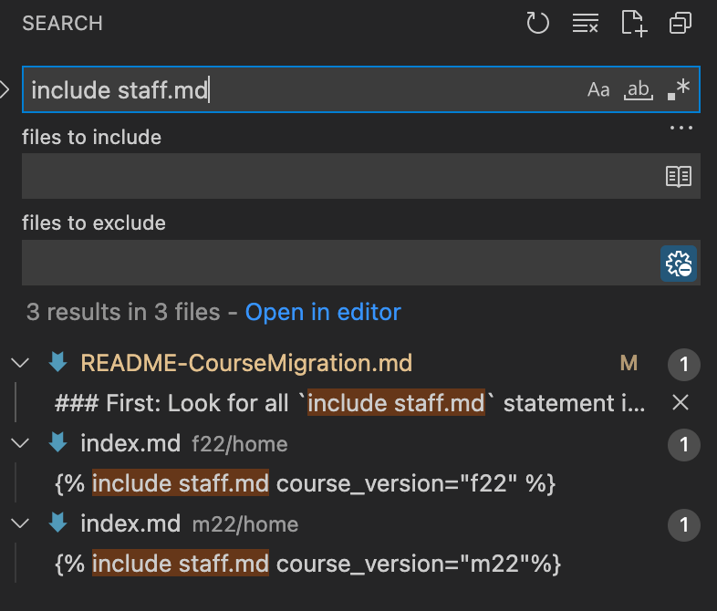
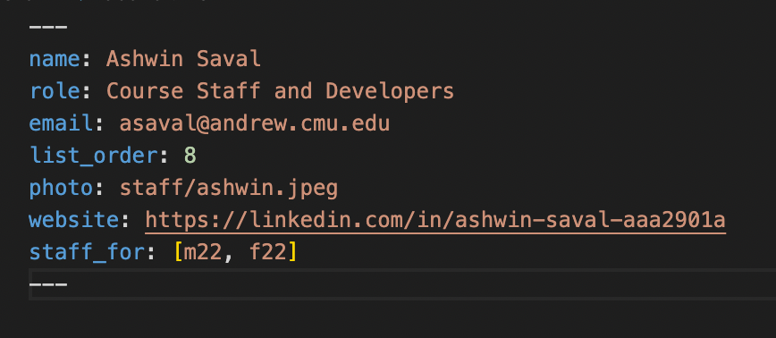

# Essentials

If you're reading this file, it means that its time to create course content for a new semester. This is not difficult, however there are some things you will need to be careful about.

1. The Staffers - If you look at the documentation structure, `staffers` are listed *outside* the course pages which are in `m22` or `s22`.
2. Set the redirect rule in `index.html` - When someone lands at `https://mcds-cmu.github.io/11631`, they are automatically redirected to the latest course version. At the time of writing this, it is `f22` for *Fall 2022*. Every time you create new course content, ensure that the redirect line in `index.html` is updated to point to the latest course landing page.

# Creating new course pages
At the time of writing this, we are creating the `f22` course page from `m22`. So consider this as an example for future migrations where `f22` is the destination course, and `m22` is the existing course for migration.

## Step 1: Duplicate the latest course folder

Step 1 is to duplicate the complete contents of `m22` to `f22`.

## Step 2: Update the redirect rule in `index.html`

## Step 3: Update the permalink for the home page in `f22/index.md`

The permalink in `f22/index.md` says that it is `m22/index.html`. This needs to be changed to `f22`. Additionally, it is a good time to review any additional permalinks in the `f22` folder in-case they are prefixed with `m22`. 

## Step 4: Update all links that contain `m22` to `f22`

Many course pages will have links like the following:

```
[Course Calendar]({{ site.baseurl }}{{ page.subpath }})
```


These links will need to be changed to be prefixed with `f22`.

## Step 5: Create a new layout and replace all page layouts inside f22

In your newly moved folder, you will notice that every markdown file uses the layout `m22`.


Navigate to `_layouts` and duplicate `m22.html` into `f22.html`. In the `f22.html` file, I changed the `nav_filter` field to `f22` from `m22`.

This will ensure that the navigation on the left does not render the links for BOTH `m22` and `f22`. If you are curious how this works and what `nav_filter` is used for, head to `_includes/nav.html` to see usage.

Finally, we will have to update **ALL** markdown files in the `f22` folder to use the `f22` layout from `m22`. This is not very difficult if you can use a `find and replace` mechanism for ONLY the `f22` folder. See how I did it with Visual Studio Code.


## Step 6: Fix the Staffers

When we offer the course every year, some staffers like TA's and RA's will change. These steps will help you determine which staffers should be displayed for each course offering.

_NOTE: This is necessary because some staffers (like Prof. Nyberg) will remain for all offerings of the course. In order to prevent duplication of staffers every year, they are all stored in the `_staffers` directory, and we simply mark which course offerings are applicable to them_

### First: Look for all `include staff.md` statement in your new folder and change the relevant `course_version` variable

This is what it looks like after I made the change.



### Next: Visit every staff member in the `_staffers` folder, and update the `staff_for` variable

Here's an example:
